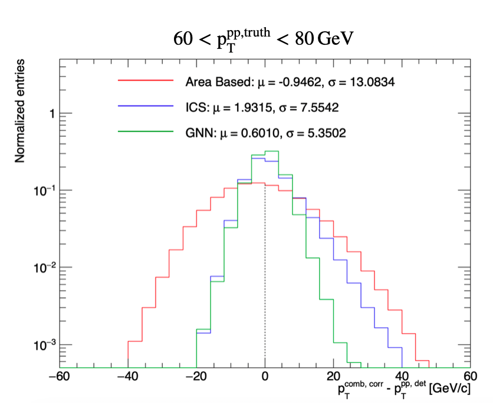
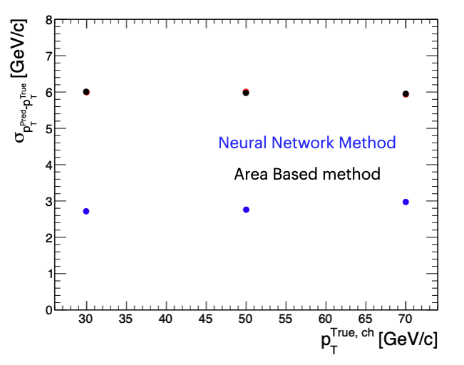

# Graph Neural Network for Particle-Level Background Correction

This project develops machine-learning methods for background subtraction in heavy-ion collisions, using data from the ALICE experiment at CERN. It follows two stages. The first is a neural network trained on Monte Carlo truth labels, which improves the correction substantially but depends on the event generator. The second is a graph neural network (GNN) trained on the output of a classical correction method, which removes that dependence.

<p align="center">
  
</p>

## Motivation

In central lead–lead (Pb–Pb) collisions, jets (collimated sprays of particles from high-energy quarks and gluons) sit on top of a large, fluctuating background of thousands of soft particles. To measure a jet's momentum accurately, that background has to be subtracted.

The standard **area-based correction** estimates the average background density ρ in each event and subtracts ρ × (jet area) from the jet. Because it only uses the event average, it cannot account for local fluctuations, which limits its accuracy.

## Approach

### 1. Neural network trained on truth labels

A fully connected network is trained on PYTHIA jets embedded in Pb–Pb events, where the true jet momentum is known. It learns to predict the true jet pT from reconstructed jet features, and it clearly improves on the area-based correction.
<p align="center">
  
</p>.

The limitation is **generator dependence**. The network learns whatever the event generator assumes about jet fragmentation and the background, and those assumptions may not match real data. This model dependence is difficult to quantify, and it becomes a systematic uncertainty on the final measurement.

### 2. Graph neural network trained on classical output

To remove the need for truth labels, the second approach uses a data-driven target:

- **ICS correction.** A particle-level classical method that subtracts background from each particle based on its local neighbourhood. This lets it respond to local fluctuations in the background, which the area-based correction averages over.
- **GNN.** A graph neural network trained on the ICS output. It learns the correction from each particle's neighbourhood and further reduces the residual errors left by ICS.

The training target comes from the event itself, not from generator truth. So the GNN carries no generator-model dependence and can in principle be trained directly on real data.

| | Truth-label NN (`neural_network_approach.py`) | GNN (`train_gnn_ics.py`) |
|---|---|---|
| Level | Jet | Particle |
| Training target | MC truth jet pT | ICS-corrected particle pT |
| Requires truth labels | Yes | No |
| Generator-model dependence | Yes | No |

## Method details

**Truth-label NN.** A fully connected network (Keras) regresses the true jet pT from reconstructed jet features, with an L2-regularised loss and early stopping. Residuals are evaluated in bins of the generated hard-scattering scale (pT-hat). An optional symbolic-regression step (PySR) fits a closed-form expression to the network's output.

**Graph construction.** Each event is represented as a graph. Nodes are particles, with features pT, η, φ and ρ. Edges connect particle pairs within ΔR < 0.3 in the (η, φ) plane, found with a KD-tree radius search.

**GNN model.** Three GraphSAGE layers followed by an MLP predict the corrected pT of each particle (node-level regression).

**Physics-informed loss.** Background subtraction can only remove momentum, so a penalty is added when the predicted pT exceeds the input pT. The penalty is weighted by (1 + pT), and its strength ramps up over the first epochs. At inference the constraint is enforced exactly by clamping.

**Export.** The trained GNN is saved in TorchScript format so it can be loaded in the C++ analysis framework.

## Results

- The truth-label network clearly improves on the area-based correction, but it is limited by generator dependence.
- The GNN improves measurement accuracy by ~2.4× compared with the area-based correction, across 2+ TB of data.
- The GNN reduces residual errors and long-tail outliers, without any generator-model dependence in training.

## Data

- ALICE minimum-bias Pb–Pb collisions, 0–10% centrality
- PYTHIA pp Monte Carlo embedded in (anchored to) the minimum-bias Pb–Pb dataset, used to train the truth-label network and to evaluate performance against truth

ALICE data are not public, so the input files are not included in this repository.

## Repository structure

```
.
├── neural_network_approach.py   # Stage 1: neural network trained on MC truth labels
├── train_gnn_ics.py             # Stage 2: GNN trained on ICS output (graph construction, training, TorchScript export)
├── GNN_ICS.png                  # Results figure
└── README.md
```

## Running the code

```bash
pip install numpy pandas scipy scikit-learn matplotlib uproot awkward torch torch_geometric tensorflow
python neural_network_approach.py
python train_gnn_ics.py
```

Input file names are set at the top of each script.

**Tools:** PyTorch, PyTorch Geometric, TensorFlow/Keras, scikit-learn, SciPy, PySR, uproot, awkward
